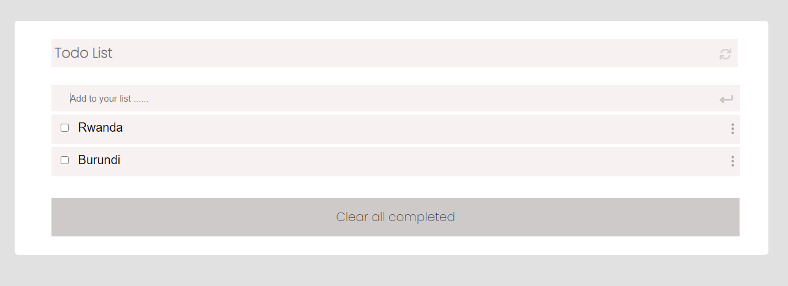

# Todo list

> this project is designed to manage daily activities, you can add remove edit and delete activity, you can select complete or uncomplete activities.

Additional description about the project and its features.

## Built With

- Javascript
- css
- html
- linter
- webpack

## Live Demo

[Live Demo Link](https://mucyosoda.github.io/TodoList/)

## Getting Started

**Download code from my repositor and run local in your computer.**

To get a local copy up and running follow these simple example steps.

### Prerequisites

install git, node, any code editor in your local machine

### Setup

clone the repo or download from https://github.com/Mucyosoda/Todo-List.git

### Install

install all dependencies with npm install

### Usage

open index.html in your local browser

## Authors

👤**Mucyo**

- GitHub: [@githubhandle](https://github.com/Mucyosoda)
- Twitter: [@twitterhandle](https://twitter.com/home)
- LinkedIn: [LinkedIn](linkedin.com/in/claude-mucyo-b95405106)

## 🤝 Contributing

Contributions, issues, and feature requests are welcome!

Feel free to check the [issues page](https://github.com/Mucyosoda/Todo-List/issues).

## Show your support

Contributions, issues, and feature requests are welcome!
Give a ⭐️ if you like this project!

## Acknowledgments

- Microverse
- MY God

## 📝 License

This project is [MIT](./MIT.md) licensed.
